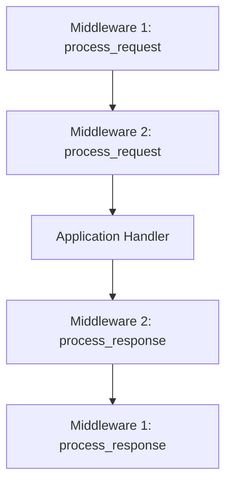

# Middleware

Middleware in Plinx provides a powerful mechanism to process requests and responses at a global level. This guide explains how middleware works and how to create your own middleware components.

## What is Middleware?

Middleware are components that "wrap" around your application to process requests before they reach your handlers and responses before they're returned to the client. They form a nested structure, like layers of an onion, with each middleware having the opportunity to:

1. Process the request before it reaches the next middleware or handler
2. Process the response after it's generated but before it reaches the client

This pattern enables cross-cutting concerns like authentication, logging, and error handling to be implemented consistently across your application.

## Middleware Execution Flow

When a request comes in, it passes through middleware in the following order:

1. The outermost middleware's `process_request` method
2. The next middleware's `process_request` method
3. ...and so on until the innermost middleware
4. The application handler
5. The innermost middleware's `process_response` method
6. The next middleware's `process_response` method
7. ...and so on until the outermost middleware
8. The final response is returned to the client

This flow can be visualized as:



## Creating a Middleware

To create a middleware in Plinx, you need to:

1. Create a class that inherits from `plinx.middleware.Middleware`
2. Override `process_request` and/or `process_response` methods
3. Register the middleware with your application

Here's a basic example:

```python
from plinx import Plinx
from plinx.middleware import Middleware

# Create a middleware class
class SimpleLoggingMiddleware(Middleware):
    def process_request(self, request):
        print(f"Request received: {request.method} {request.path}")
        # You can modify the request here if needed
        
    def process_response(self, request, response):
        print(f"Response generated: {response.status_code}")
        # You can modify the response here if needed
        
# Register the middleware with your application
app = Plinx()
app.add_middleware(SimpleLoggingMiddleware)
```

## Common Middleware Use Cases

### Authentication Middleware

```python
class AuthenticationMiddleware(Middleware):
    def process_request(self, request):
        request.user = None
        auth_header = request.headers.get("Authorization", "")
        
        if auth_header.startswith("Bearer "):
            token = auth_header[7:]
            try:
                # Validate token and get user (implementation depends on your auth system)
                request.user = self.get_user_from_token(token)
            except Exception:
                # Token is invalid
                pass
                
    def get_user_from_token(self, token):
        # Implement your token validation logic here
        pass
```

### CORS Middleware

```python
class CORSMiddleware(Middleware):
    def process_response(self, request, response):
        response.headers["Access-Control-Allow-Origin"] = "*"
        response.headers["Access-Control-Allow-Methods"] = "GET, POST, PUT, DELETE, OPTIONS"
        response.headers["Access-Control-Allow-Headers"] = "Content-Type, Authorization"
```

### Request Timing Middleware

```python
import time

class TimingMiddleware(Middleware):
    def process_request(self, request):
        request.start_time = time.time()
        
    def process_response(self, request, response):
        if hasattr(request, "start_time"):
            duration = time.time() - request.start_time
            response.headers["X-Request-Duration"] = f"{duration:.6f}"
```

## Order of Middleware Execution

The order in which you add middleware to your application is important. Middleware added first will be the outermost layer (first to process requests, last to process responses). Middleware added last will be the innermost layer (last to process requests, first to process responses).

```python
app = Plinx()

# First added = outermost layer
app.add_middleware(SecurityMiddleware)  # Will process requests first
app.add_middleware(LoggingMiddleware)   # Will process requests second
app.add_middleware(TimingMiddleware)    # Will process requests last, responses first
```

## Best Practices

1. **Keep middleware focused**: Each middleware should have a single responsibility
2. **Be mindful of the execution order**: Add middleware in the correct order
3. **Avoid heavy processing**: Middleware runs for every request, so keep it efficient
4. **Pass data through request attributes**: To share data between middleware and handlers
5. **Consider short-circuiting**: Return a response early from `process_request` for things like authentication failures